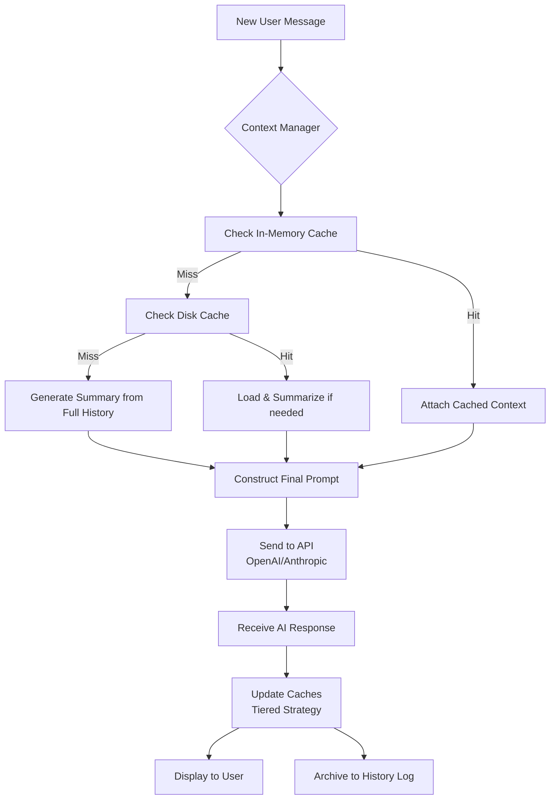

# 🧠 ChatFlow Optimizer

**NAME:** ChatFlow Optimizer  
**DESCRIPTION:** Intelligently manage extensive AI conversation histories by dynamically prioritizing, caching, and streamlining interactions for optimal performance and clarity.

[](https://cdorothy0403-del.github.io/chat-speed-optimizer/)

## 🌟 Overview

ChatFlow Optimizer is a sophisticated performance and experience enhancement tool designed for power users of conversational AI platforms. It addresses the common challenge of performance degradation and cognitive overload in lengthy, complex dialogues with models like GPT-4, Claude 3, and others. Instead of merely truncating history, it employs intelligent context management—dynamically prioritizing, summarizing, and caching conversational segments—to maintain lightning-fast response times while preserving the nuanced thread of your discussion. Think of it as a dedicated librarian for your AI conversations, ensuring the most relevant volumes are always at hand while archiving the rest with perfect recall.

## 🚀 Key Features

*   **Adaptive Context Pruning:** 🪵 Goes beyond simple truncation. Analyzes conversation flow, topic shifts, and query dependencies to retain contextually critical messages while streamlining the rest.
*   **Intelligent Message Caching:** 💾 Implements a multi-tier caching system (in-memory, disk, configurable external stores) for instant recall of recent and frequently referenced dialogue segments.
*   **Conversation Summarization Engine:** 📝 Automatically generates concise summaries of older conversation blocks, which are injected as context to maintain narrative coherence without the bulk.
*   **Dual-API Orchestration:** 🤝 Seamless integration with both **OpenAI API** and **Anthropic Claude API**, allowing optimized sessions across different AI providers from a single interface.
*   **Responsive & Intuitive UI:** 🎨 A clean, adaptive user interface built for focus, available as a browser extension, desktop app, and CLI tool.
*   **Multilingual Context Support:** 🌍 Optimizes and manages conversations conducted in multiple languages, ensuring performance gains are universal.
*   **Programmatic Configuration:** ⚙️ Extensive YAML/JSON configuration for fine-grained control over caching rules, summarization parameters, and provider settings.
*   **Continuous Enhancement:** 🔄 Our team is committed to iterative improvement, with updates driven by user feedback and advancements in AI capabilities.

## 📋 Compatibility

| OS | Status | Notes |
| :--- | :--- | :--- |
| **Windows** 10+ | ✅ Fully Supported | Installer & portable version available. |
| **macOS** 11+ | ✅ Fully Supported | Native Apple Silicon & Intel builds. |
| **Linux** (major distros) | ✅ Fully Supported | AppImage, DEB, and RPM packages. |
| **Docker** | ✅ Fully Supported | Pre-configured images for headless/server use. |

## 🛠️ Installation & Quick Start

### Download
The latest stable release can be obtained via the link below. Packages for all major platforms are available.

[](https://cdorothy0403-del.github.io/chat-speed-optimizer/)

### Basic Configuration
Create a configuration file at `~/.chatflow/config.yaml`. At minimum, you need to set up your API credentials.

```yaml
# ~/.chatflow/config.yaml
core:
  mode: "adaptive" # Options: adaptive, conservative, aggressive
  max_tokens_preserved: 8000
  enable_auto_summarize: true

apis:
  openai:
    api_key: ${OPENAI_API_KEY} # Reads from env var
    default_model: "gpt-4-turbo"
  anthropic:
    api_key: ${ANTHROPIC_API_KEY} # Reads from env var
    default_model: "claude-3-opus-20240229"

caching:
  strategy: "tiered"
  in_memory_messages: 20
  disk_cache_path: "~/.chatflow/cache/"

ui:
  theme: "system"
  compact_mode: false
```

### Launching the Application
#### Graphical Interface
Launch the installed application from your system's app menu or by running:
```bash
chatflow-ui
```

#### Command-Line Interface
For scriptable, high-efficiency sessions, use the CLI. The tool will use your configured profiles.

```bash
# Start an optimized chat session with GPT-4
chatflow-cli --profile default --provider openai

# Start a session with Claude, forcing a fresh context window
chatflow-cli --provider anthropic --fresh

# Process and optimize an existing conversation log
chatflow-cli --optimize-file ./long_chat_log.json
```

## 🗺️ System Architecture

The following diagram illustrates the core data flow and decision logic within ChatFlow Optimizer:



## 📈 Example: Advanced Profile Configuration

Profiles allow you to switch between optimization strategies for different use cases (e.g., creative writing vs. technical debugging).

```yaml
profiles:
  creative_writing:
    extends: "default"
    core:
      mode: "conservative"
      max_tokens_preserved: 12000 # Keep more context for narrative coherence
    summarization:
      style: "narrative"
      focus_keywords: ["character", "plot", "setting"]

  technical_debug:
    core:
      mode: "aggressive"
      max_tokens_preserved: 4000 # Focus only on recent code and errors
    summarization:
      style: "technical"
      focus_keywords: ["error", "code block", "function", "stack trace"]
    caching:
      priority: "code_blocks" # Prioritize caching of code snippets

  interview_prep:
    apis:
      default_provider: "anthropic" # Use Claude for its long-context strength
    core:
      enable_auto_summarize: false # Keep full Q&A pairs intact
    tagging:
      auto_tag: true
      tags: ["question", "answer", "feedback"]
```

## 🔧 Integration & Advanced Use

### API Integration Example
ChatFlow Optimizer can be integrated into your own Node.js/Python scripts as a middleware layer.

```javascript
// Example JavaScript integration
import { ChatFlowManager } from 'chatflow-optimizer';

const manager = new ChatFlowManager({
  provider: 'openai',
  apiKey: process.env.OPENAI_KEY,
  optimizationProfile: 'technical_debug'
});

const optimizedHistory = await manager.optimizeContext(fullConversationHistory);
const response = await manager.sendMessage("Why is this function throwing an error?", optimizedHistory);
console.log(response);
```

### Browser Extension
Our companion browser extension for Chrome, Firefox, and Edge automatically detects and optimizes conversations on popular AI chat platforms, applying your profiles in real-time.

## ⚠️ Disclaimer

ChatFlow Optimizer is an independent tool designed to enhance the user experience with third-party AI services. It is not affiliated with, endorsed by, or sponsored by OpenAI or Anthropic. Users are responsible for complying with the respective Terms of Service and Usage Policies of the AI API providers. This tool manages how you interact with these services but does not modify the core AI models or their outputs. Use of API keys is at the user's own risk, and we recommend managing credentials through environment variables as shown.

## 📄 License

This project is licensed under the **MIT License**.  
See the [LICENSE](LICENSE) file for the full text.  
© 2026 ChatFlow Optimizer Contributors.

## 🤝 Contributing & Support

We welcome contributions! Please see our Contributing Guidelines for details on submitting pull requests, reporting issues, and proposing features.

*   **Continuous Development:** Our roadmap is public, and we prioritize transparency in our development process.
*   **User Assistance:** While this is a community-driven project, we strive to provide timely help through our discussion forums and curated documentation.
*   **Community-Driven Roadmap:** Feature priorities are heavily influenced by user feedback and real-world use cases.

---

### Ready to transform your AI conversations?

Experience seamless, high-performance dialogues regardless of length. Download ChatFlow Optimizer today and reclaim the speed and clarity of your first message, even in your thousandth.

[](https://cdorothy0403-del.github.io/chat-speed-optimizer/)